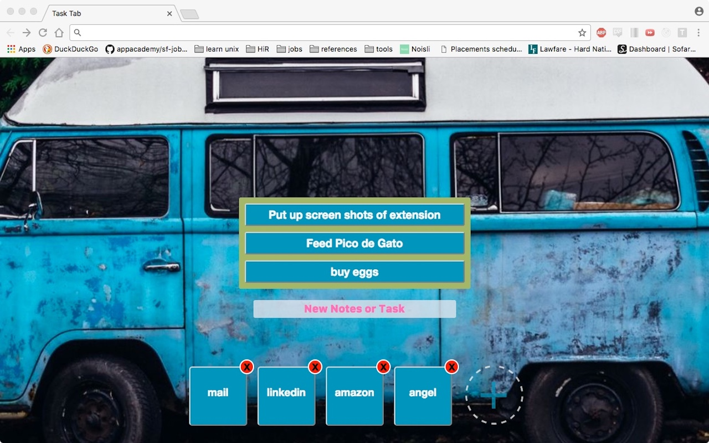

#Task Tab Chrome Extension#

[Extension Live](https://chrome.google.com/webstore/detail/task-tab/poffkffaalagjjfhpmconpdcakpjaakc)

##Features and Implementation##

###New Tab Replacement###
Using a JSON manifest file, and a regular HTML file I created an extension that replaces the default new tab page with my own page.

###Tasks & Favorites###
Using Google Chrome's Local Storage API, HTML forms, and ES6 Javascript I implemented a single page app that allows user to update and delete tasks, and add links to their favorite sites on the default new tab.

###Background Image###
Using the site Unspash.it I make a request for a random image.  Then using css I resize the image to fit the window and then make that image the windows background.  I made extensive use of flex box to responsively position the elements.   Finally using media queries I resize all the elements to make sure they stay on the screen as the window resizes.

##Screen Shots##

